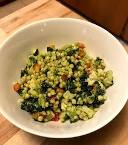

[Link to download PDF of this cookbook](https://github.com/sstevens2/recipes/raw/master/index.pdf)

This recipe book is hosted on [Github](github.com) and you can suggest changes or report issues in [this repository](https://github.com/sstevens2/recipes).

## Avocado Greek Yogurt Green Goddess Dressing

Modified from Antoni Porowski's Recipe as seen on [Queer Eye](https://en.wikipedia.org/wiki/Queer_Eye_(2018_TV_series))

### Ingredients
- 1 bunch Parsley
- 1 bunch Cilantro
- 1 bunch green onions
- ~ 7 tbps oil (add more to make it smoother)
- 1 cup greek yogurt
- 1 avocado
- juice of 1 lemon
- 3 cloves garlic
- salt and pepper

### Instructions
1. Combine in food processor until desired constancy.
You may need to add more oil if it isn't smooth enough.

2. Salt and pepper to taste.

## Kale Veggie Couscous Salad

Original Recipe from Sarah. Goes great with the [Avocado Greek Yogurt Green Goddess Dressing](#Avocado-Greek-Yogurt-Green-Goddess-Dressing)

### Ingredients 
- 1 bunch of Kale
- 1 medium bell pepper
- 1-1.5 cups cherry tomatoes
- 1 cauliflower head
- 1 garlic clove
- 1 cup uncooked couscous
- olive oil
- salt and pepper

### Instructions
1. Chop the veggies.
	- Roughly chop the kale.
	- Small dice the bell pepper
	- Roughly chop the cherry tomatoes (or leave whole if you wish)
	- Make a paste of the garlic (I like to grate with the zester)
	- Core the cauliflower and cut into florets

2. Toss the cauliflower in ~ 1-2 tablespoons olive oil, salt, pepper, and the garlic paste.
Then roast in the oven on a pan for 20 min (don't remember the temp), flipping halfway through.
Once the cauliflower has cooled cut it into smaller pieces for the salad.

3. While the cauliflower roasts, cook the couscous according to the instructions on the package.
Mine recommended adding in stock to the water so I added veggie stock.

4. While the couscous and cauliflower cook, cook the kale on the stove with oil until it breaks down a little.
I like mine to be still a bit firm.

5. Assemble the salad.
Mix the couscous, caulflower, kale, bell peppers, and cherry tomatoes together.
Dress with dressing of choice.
If not serving right away, you may want to store it in the fridge without dressing and cherry tomatoes.

